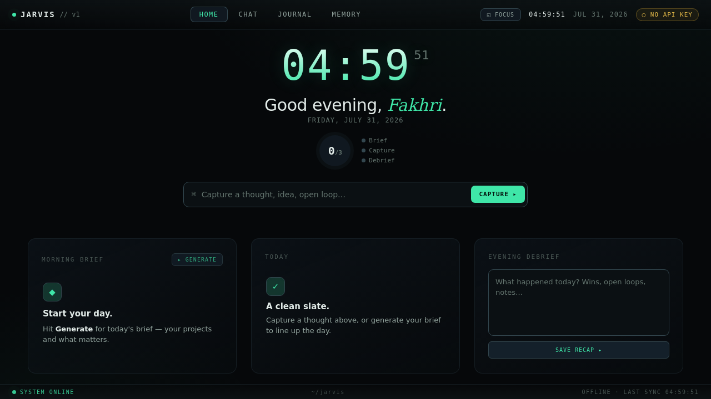

# Jarvis — a portable, engine-agnostic assistant "brain"

A personal-assistant **brain that lives in plain files**, not inside any one app. The
instructions, memory, skills, and tools are all Markdown + Python in this repo — so any
agent runtime (Claude Code, Codex, Cursor, a local model via Ollama, or a custom app) can
read it and *become* the same assistant. Individual chats stay disposable; the context
underneath them persists.

> **Design thesis:** one brain, many thin clients. State lives in the repo; every surface
> (CLI, dashboard, phone) is a stateless window onto it. See
> [`docs/architecture.md`](docs/architecture.md) for the full decision record.



---

## Why it's built this way

**Portable by standard, not by lock-in.** Instructions live in [`AGENTS.md`](AGENTS.md)
(the cross-engine open standard) so 20+ tools read the same brain. Nothing assumes a
specific model or harness.

**Provider-agnostic LLM layer.** Every model call goes through one wrapper
([`tools/llm.py`](tools/llm.py)) that resolves its provider from
[`config/providers.yaml`](config/providers.yaml). Switching from Gemini to a self-hosted
Qwen is **one line** — no code change:

```bash
python tools/llm.py            # active model: gemini/gemini-2.5-flash
# edit config/providers.yaml → active: ollama-qwen
python tools/llm.py            # active model: ollama/qwen2.5  (no API key required)
```

**Two-tier memory that never lies to you.** Episodic journals (`memory/journal/`, one
append-only file per day) are the permanent source of truth; a small deduplicated durable
overlay (`memory/*.md`) is the fast-recall index built *from* them — never a summary that
replaces them.

**Deterministic, keyless tests.** The model layer is mocked, so the suite runs with no API
key and makes no network calls.

---

## The dashboard

An "operator OS" web dashboard (FastAPI + a hand-built, dependency-free frontend) that reads
the same brain files. It's an installable **PWA** — one codebase installs to the desktop and
the phone home screen — with a service worker that keeps the shell offline-capable but never
caches your live data.

```bash
python dashboard/server.py     # → http://localhost:8000
```

Works fully offline (brief, capture, journal, memory); add a `GEMINI_API_KEY` to `.env` to
turn on chat and AI-written briefs.

---

## Repo layout

| Path | What it is |
|------|------------|
| `AGENTS.md` | The master brain — who the assistant is and how it behaves. Read first. |
| `config/providers.yaml` | Active model + alternates (the only place a provider is named). |
| `tools/` | Deterministic Python tools (journal, brief, debrief) + the `llm.py` provider wrapper + a keyless `validate.py` repo-doctor. |
| `skills/` | Reusable procedures (`*.md`) the assistant loads before acting. |
| `memory/` | Two-tier memory. **Ships with example data**; real personal memory is git-ignored. |
| `dashboard/` | FastAPI backend + PWA frontend. |
| `docs/architecture.md` | Standing architecture decision record. |
| `tests/` | Deterministic unit tests (mocked model layer, no key needed). |

---

## Quickstart

```bash
# 1. install (tools + dashboard)
pip install -r tools/requirements.txt -r dashboard/requirements.txt

# 2. (optional) add a free Gemini key to enable AI features
cp .env.example .env            # then paste your key

# 3. run the tests (no key required)
python -m unittest discover -s tests

# 4. launch the dashboard
python dashboard/server.py      # → http://localhost:8000
```

**CLI, no dashboard needed:**

```bash
python tools/brief.py --write        # morning brief → today's journal
python tools/debrief.py --text "…"   # evening recap
python tools/validate.py             # lint skills + memory before committing
```

---

## Tech stack

Python · FastAPI · LiteLLM (provider abstraction) · vanilla JS/CSS PWA (zero frontend
deps, firewall-safe) · `unittest`. Model-agnostic: Gemini, OpenRouter (Qwen/Kimi), or local
Ollama — all config-only.

## Notes

This is a personal project and a learning vehicle for mastering agent harnesses. The `memory/`
directory ships with **example** data — the maintainer's real memory and daily journals are
git-ignored and never published.
